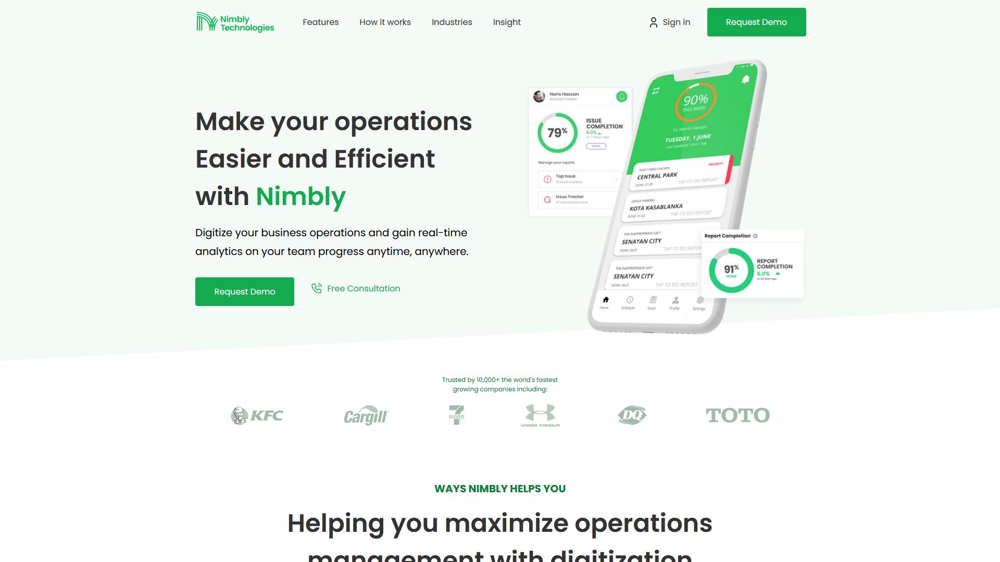

# Nimbly

I don't know want to say about the website.

## Functionality of the project

The website provides users with information about the services of the company, allows them to get free advice, as well as to apply for a demo version of the product provided by the company.

You can visit the website by clicking on [this link](https://kanae367.github.io/nimbly/)

## The project was made using the following technologies:

- HTML5
- CSS3
- JS
- Flex

## How to start

Clone the repository using the following command: 

`git clone https://github.com/kanae367/nimbly.git`